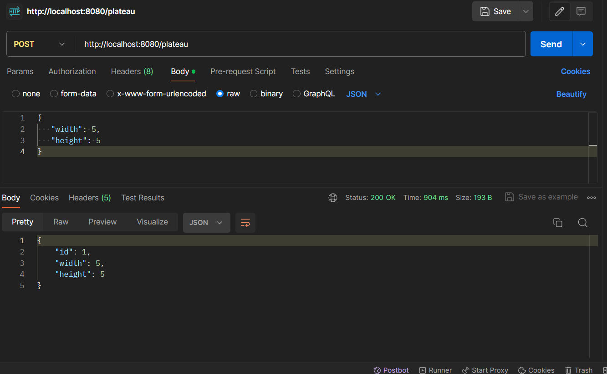
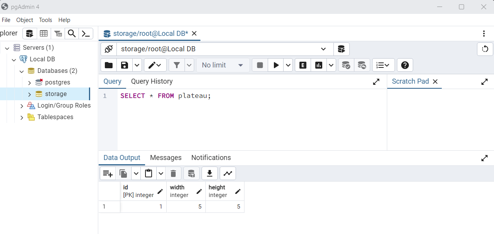
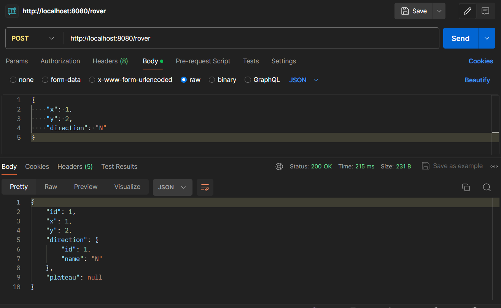
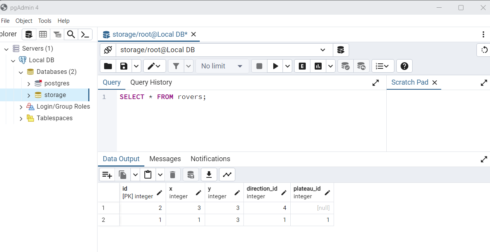
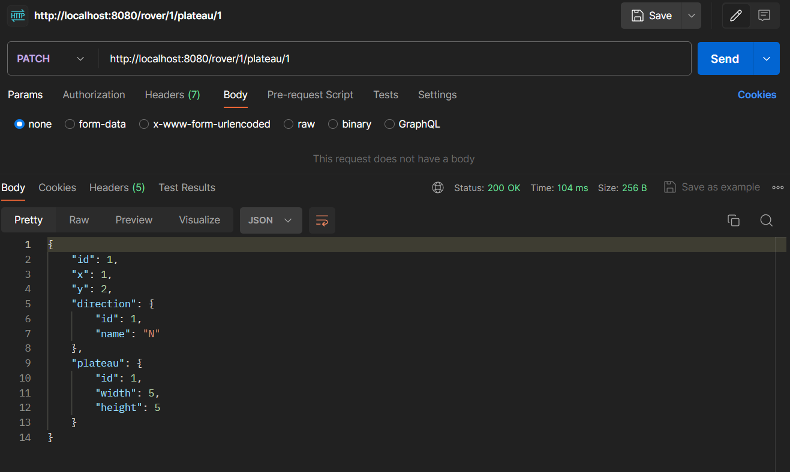
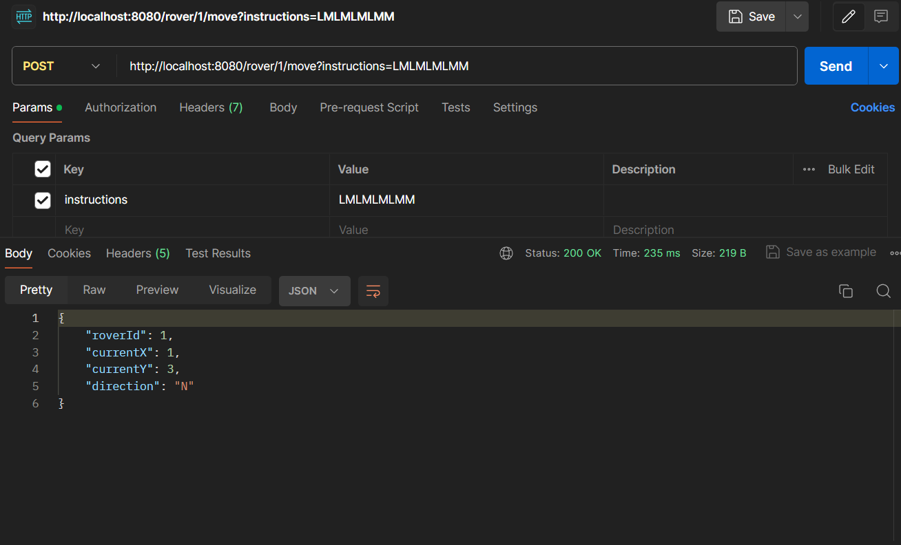
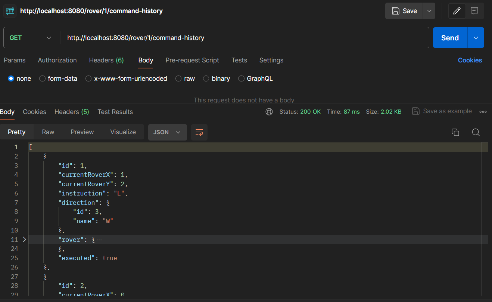
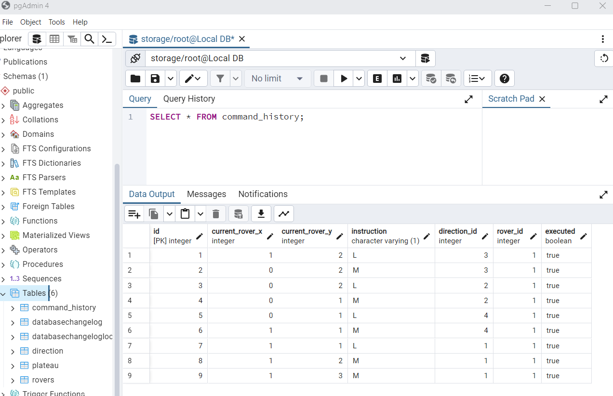
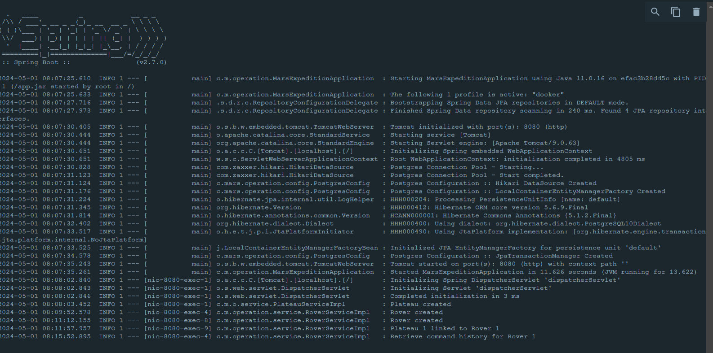
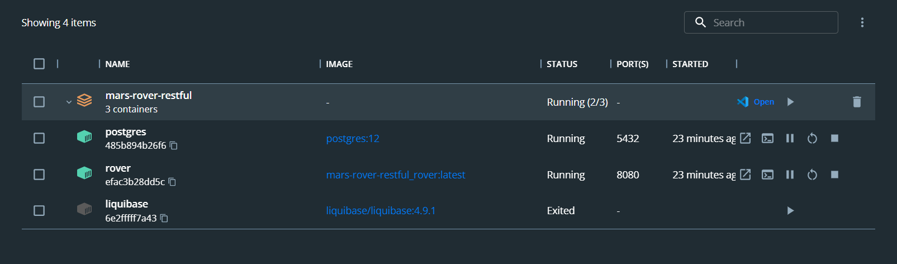

# Mars Rover

In this repository, I have designed two implementations for the Mars Rover application. One of them is a RESTful Spring Boot web application and the second implementation in via a unit test which can be found in test/java/com/mars/operation/task/MarsMission.java.   

The web application runs on localhost:8080.

# Brief overview

### Create a Plateau

POST /plateau

### Create a Rover

POST /rover

### Link Rover to Plateau

PATCH /rover/{roverId}/plateau/{plateauId}

### Move Rover

POST /rover/{id}/move

### Inspect history of the commands (whether they are executed or not)

GET /rover/{id}/command-history

# Technical overview

## Start the application

Just clone (git clone https://github.com/ivanovbiol/mars-rover-restful.git) the repository and Gradle **bootJar** the project with **docker** profile in order to generate the **.jar** file for the compiled code. After that, execute the **docker-compose up** command in the root folder to start all Docker containers: Dockerized Spring Boot application, PostgreSQL and Liquibase (see **docker-compose.yml** and **Dockerfile** in the root folder). Sample data (tables and relations between them) will be imported/created automatically into PostgreSQL via Liquibase container.

 - Note: In order to start the application you need to have Docker Desktop installed on your machine.
 
 

## Databases

### Primary database 

**PostgreSQL** (official postgres Docker image). 
 - DB: **storage**.

I can't demonstrate UML diagram since my IntelliJ ultimate license expired - sorry about that).

## Backend 

 - **Spring boot** used to create stand-alone application. 
 - **Gradle** used as a build tool. 
 - **Spring Data JPA** with native and JPQL queries adopted as repository layer for PostgreSQL.
 - **PostgreSQL** (official postgres Docker image) used as a database.
 - **Liquibase** (official liquibase Docker image) creates the tables and imports sample data in PostgreSQL DB on project starup (see **resources/db/chaneLog/changeLog.xml**).
 - **Slf4j** logs performed actions .

 
 - All tools along with the Dockerized Spring Boot app (**rover** container) are instantiated as Docker containers after **docker-compose up**. (The liquibase container starts, imports the data and after that shuts down - check the logs of the container. If by any chance the container can't connect with the database, just restart it and it will import the data.)
 

